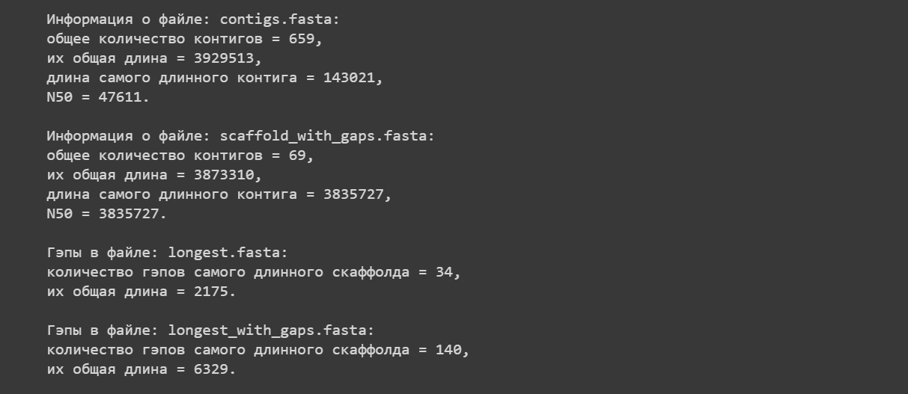

# Домашнее задание №1

*Выполнила Михайлова Ксения БПИ191*

## Задание №1

Выполненные [комнады](https://github.com/t0pcup/hse21_hw1/blob/master/src/commands.sh):

```bash
func() {
  rm -rf fastqc multiqc
  mkdir fastqc multiqc
  time fastqc "$@" -o fastqc
  multiqc fastqc -o multiqc
}

SEED=404
rm -rf data
mkdir data
cd data
ln --symbolic /usr/share/data-minor-bioinf/assembly/oil* .
git clone https://github.com/t0pcup/hse21_hw1.git

seqtk sample -s$SEED oil_R1.fastq 5000000 > sub1.fastq
seqtk sample -s$SEED oil_R2.fastq 5000000 > sub2.fastq
seqtk sample -s$SEED oilMP_S4_L001_R1_001.fastq 1500000 > mp1.fastq
seqtk sample -s$SEED oilMP_S4_L001_R2_001.fastq 1500000 > mp2.fastq

func sub*.fastq mp*.fastq
cp multiqc/multiqc_report.html hse21_hw1/multiqc.html
time platanus_trim sub*.fastq
rm sub*.fastq
time platanus_internal_trim mp*.fastq
rm mp*.fastq

func *trimmed
cp multiqc/multiqc_report.html hse21_hw1/multiqc_trimmed.html
time platanus assemble -f *.trimmed
mkdir hse21_hw1/data
cp out_contig.fa hse21_hw1/data/contigs.fasta

time platanus scaffold -c out_contig.fa -IP1 *.trimmed -OP2 *.int_trimmed
cp out_scaffold.fa hse21_hw1/data/scaffold_with_gaps.fasta
time platanus gap_close -c out_scaffold.fa -IP1 *.trimmed -OP2 *.int_trimmed
cp out_gapClosed.fa hse21_hw1/data/scaffold.fasta
rm *trimmed

cd hse21_hw1
git config user.email "t0pcup@yandex.ru"
git config user.name "Mikhaylova Ksenia"
git add .
git commit -m "data"
git push git@github.com:t0pcup/hse21_hw1.git master

sed -n "/$(grep '^>' data/scaffold_with_gaps.fasta | sort -k2V -t_ | tail -n 1)/,/^>/p" data/scaffold_with_gaps.fasta | head -n -1
sed -n "/$(grep '^>' data/scaffold.fasta | sort -k2V -t_ | tail -n 1)/,/^>/p" data/scaffold.fasta | head -n -1
```

## Полученные отчёты multiQC

### [Исходные чтения](https://t0pcup.github.io/hse21_hw1/blob/master/multiqc.html)


### [Подрезанные чтения](https://t0pcup.github.io/hse21_hw1/blob/master/multiqc_trimmed.html)


## Питон ([colab](https://colab.research.google.com/drive/1qGvdG4N1OOubl3FQFncAB63E7ooTg4Ju?usp=sharing))

Клонируем репозиторий в тетрадь:

```python
!git clone https://github.com/t0pcup/hse21_hw1.git
```

Python output:


Определим функции описывающие файл:

```python
def info(file):
  lens = !grep '^>' $file | sed -E 's/^.*len([0-9]+).*$/\1/'
  contigs = sorted((int(e) for e in lens), reverse = True)
  score = 0

  for e in contigs:
    score += e
    if score >= sum(contigs)/2:
      N50 = e
      break
  
  print(f"Файл: {file}:")
  print(f"общее количество контигов = {len(contigs)},")
  print(f"их общая длина = {sum(contigs)},")
  print(f"длина самого длинного контига = {contigs[0]},")
  print(f"N50 = {N50}.\n")

def gaps(file):
  num = !grep -Ec 'N+' $file
  total = !grep -Eo 'N+' $file | tr -cd 'N' | wc -c
  print(f"Файл: {file}:")
  print(f"количество гэпов самого длинного скаффолда = {num[0]},")
  print(f"их общая длина = {total[0]}.\n")
```

Вызовем для нужных файлов:

```python
info("hse21_hw1/data/contigs.fasta")
info("hse21_hw1/data/scaffold_with_gaps.fasta")

gaps("hse21_hw1/data/longest.fasta")
gaps("hse21_hw1/data/longest_with_gaps.fasta")
```

Python output:


